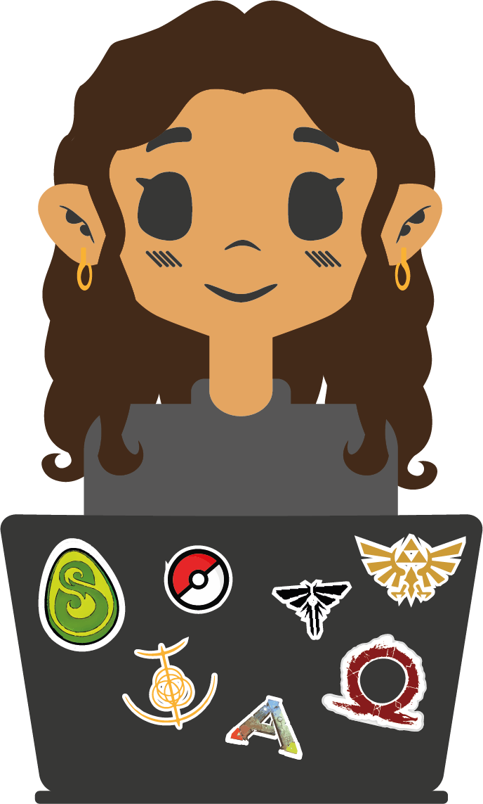

  

<h3>
   Qui suis-je ?
</h3>

 

  Moi, c'est <strong>Inès</strong>, étudiante de troisième année en <strong>développement web</strong> : 
  📲 <em>Front</em>   •  💡 <em>Back</em>  •   📂 <em>Database</em>  •  💻 <em>Linux</em>  •  ✏️ <em>Design</em>

 

En tant qu’étudiante en BUT MMI (Métiers du Multimédia et de l'Internet) spécialisée dans le développement web, j’aime créer des projets qui mêlent technologie, créativité et expérience utilisateur. Ce qui me passionne, c’est autant le fait de développer des fonctionnalités que d’imaginer des univers visuels et interactifs qui donnent vie aux idées !

Mon objectif est de concevoir des expériences digitales modernes, accessibles et humaines, tout en continuant à explorer les nombreuses possibilités qu’offre le web créatif et interactif :)

 

_As a BUT MMI student specializing in web development, I enjoy creating projects that blend technology, creativity, and user experience. What I love most is not only building features, but also imagining visual and interactive worlds that bring ideas to life!_

_My goal is to design modern, accessible, and human-centered digital experiences, while continuing to explore the many possibilities offered by creative and interactive web development :)_

 

<h3>
   Mes compétences
</h3>

Développement web & Visualisations

 

  
  
  
  
  
  
  
  
  
  
  
  
  

Outils de développement & Database

 

  
  
  
  
  
  
  
  
  

  

Environnements, systèmes & serveurs

 
  

  
  
  
  
  
  
  

Design UI/UX & maquettage

 
  

  
  
  
  
  

 

#### Ce que j'apprends / aimerais apprendre :

  
  
  
  
  
  
  
  
  

 

<!--   -->

  

