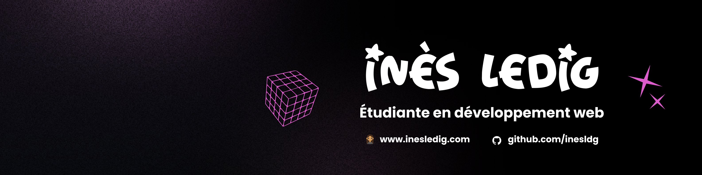
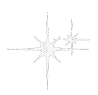

  

<h3>
   Qui suis-je ?
</h3>

 

  Moi, c'est <strong>Inès</strong>, étudiante de troisième année en <strong>développement web</strong> : 
  📲 <em>Front</em>   •  💡 <em>Back</em>  •   📂 <em>Database</em>  •  💻 <em>Linux</em>  •  ✏️ <em>Design</em>

 

En tant qu’étudiante en BUT MMI (Métiers du Multimédia et de l'Internet) spécialisée dans le développement web, j’aime créer des projets qui mêlent technologie, créativité et expérience utilisateur. Ce qui me passionne, c’est autant le fait de développer des fonctionnalités que d’imaginer des univers visuels et interactifs qui donnent vie aux idées.

Curieuse et toujours prête à apprendre de nouvelles choses, je m’intéresse aussi à l’intelligence artificielle et à la façon dont elle peut enrichir la création numérique et ouvrir de nouvelles possibilités. J’aime expérimenter, tester, concevoir et transformer des idées en projets concrets, utiles et engageants !

Mon objectif est de concevoir des expériences digitales modernes, accessibles et humaines, tout en continuant à explorer les nombreuses possibilités qu’offre le web créatif et interactif :)

 

_As a BUT MMI student specializing in web development, I enjoy creating projects that blend technology, creativity, and user experience. What I love most is not only building features, but also imagining visual and interactive worlds that bring ideas to life._

_Curious and always eager to learn new things, I’m also interested in artificial intelligence and how it can enrich digital creation and open up new possibilities. I enjoy experimenting, testing, designing, and turning ideas into concrete, useful, and engaging projects._

_My goal is to design modern, accessible, and human-centered digital experiences, while continuing to explore the many possibilities offered by creative and interactive web development._

 

<!--   -->

  

